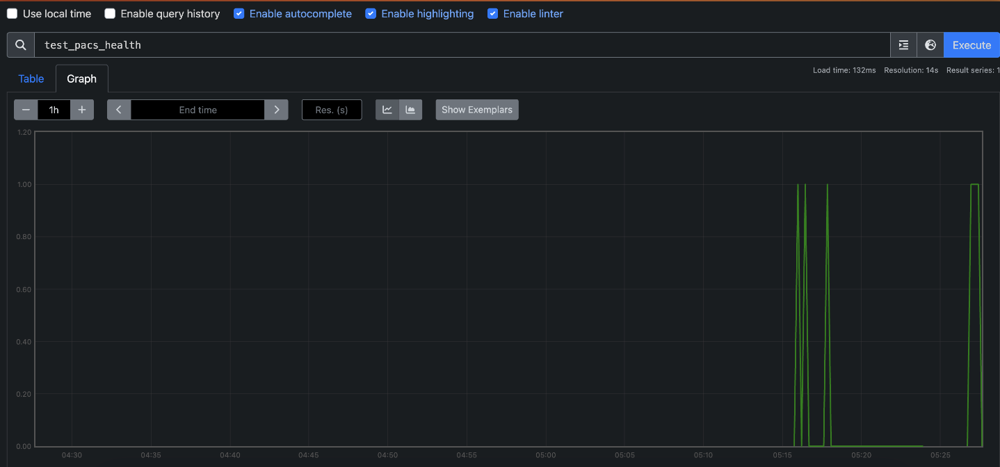
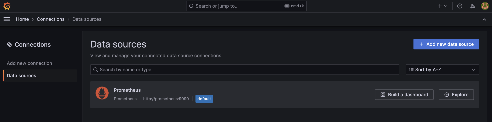
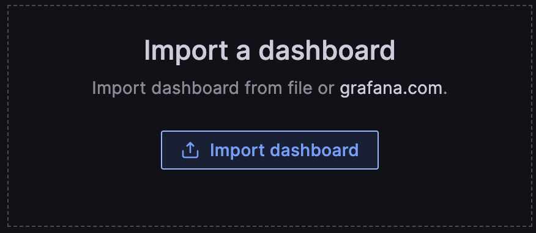
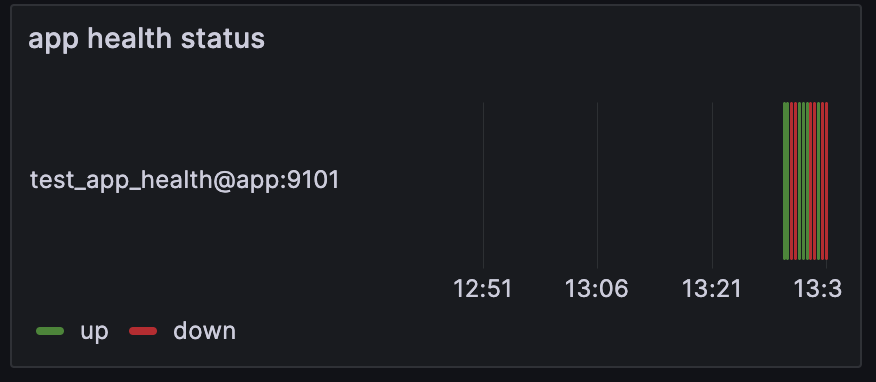

# prometheous try it out 

start services

```sh
docker-compose up -d
```

prometheus scapes stuff and we can see it [here](http://localhost:9100/graph?g0.expr=test_pacs_health&g0.tab=0&g0.stacked=0&g0.show_exemplars=0&g0.range_input=1h) in chrome browser



we add new prometheus datasource for grafana [here](http://localhost:3000/connections/datasources) in chrome browser (connection string is `http://prometheus:9090` ) (user/password: `admin`/`admin`)





import the dashboard in [grafana](grafana/dashboard.json) and we have a board like this


